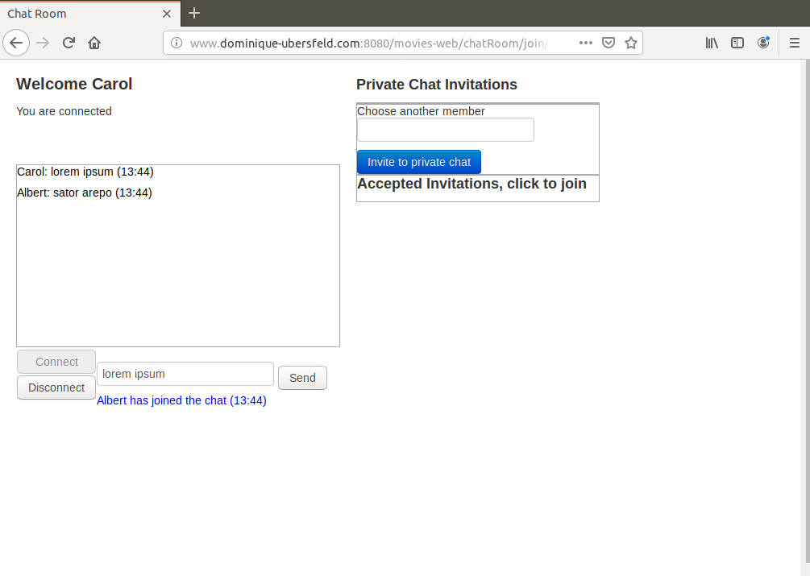
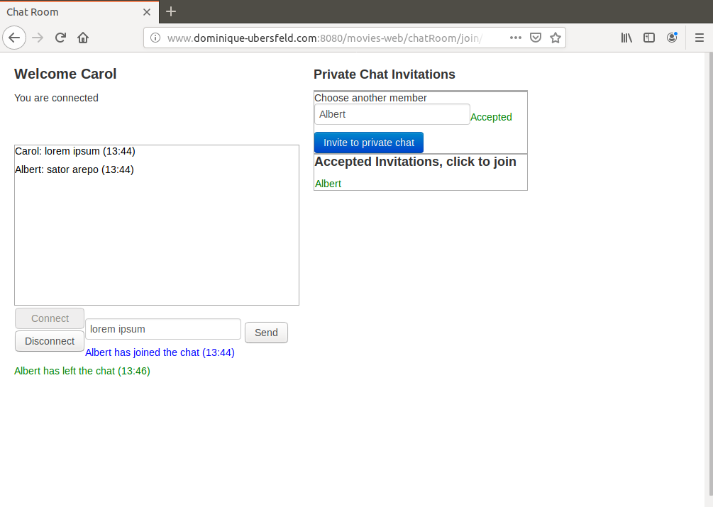
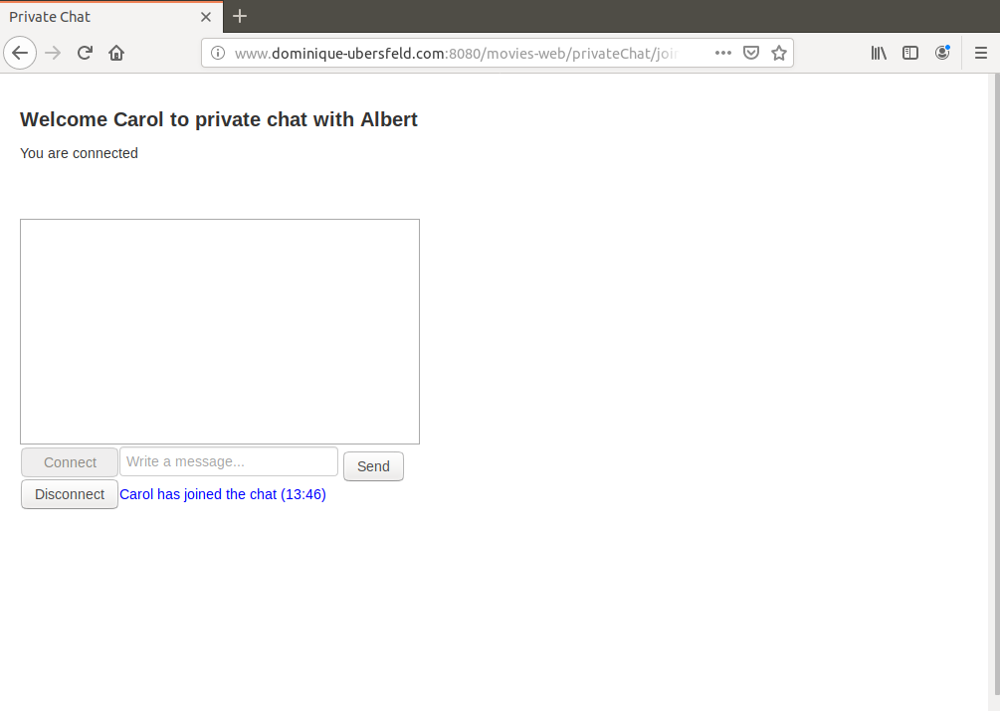
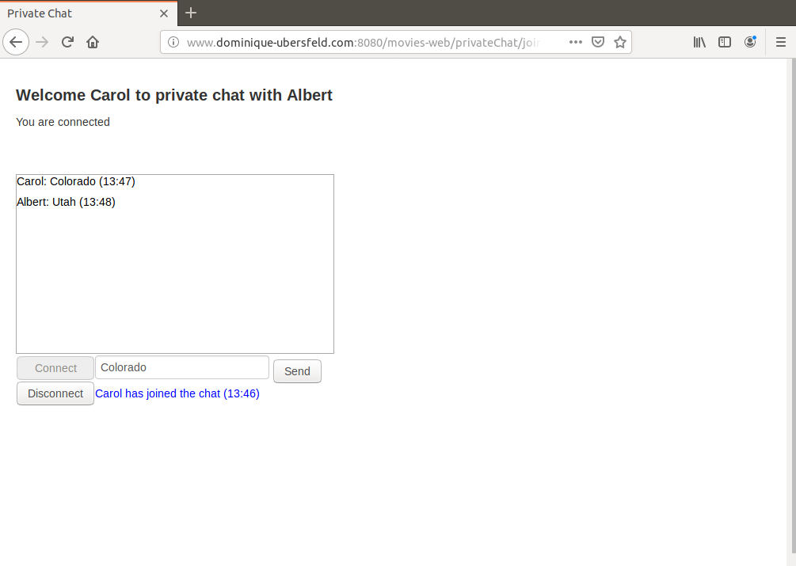

# MoviesWebPrivateChat
Spring based Web site with CrudRepository support, Spring Security and dynamically created WebSocket based private chat sessions

This is a demonstration project on Spring development. It involves:
MySQL as a database server 

moviesDBChat.sql was used to generate the MySql database used in this project.

For the basic JDBC version of this project see the repository:

https://github.com/dubersfeld/MoviesWebJDBC

For the JPQL version of this project see the repository:

https://github.com/dubersfeld/MoviesWebJPQL

For the Criteria version of this project see the repository:

https://github.com/dubersfeld/MoviesWebCriteria

For the CrudRepository version of this project see the repository:

https://github.com/dubersfeld/MoviesWebCrud

For the Spring Security version of this project see the repository:

https://github.com/dubersfeld/MoviesWebSecurity

For the static chat room version of this project see the repository:

https://github.com/dubersfeld/MoviesWebChat

Note on authorities:

I have predefined 5 authorities: VIEW, CREATE, UPDATE, DELETE, CHAT

The source file moviesDBSecu.sql declares 5 users with different authorities and passwords listed below:

Username        Password        Authorities

Carol           s1a2t3o4r       VIEW, CHAT

Albert          a5r6e7p8o       VIEW, CHAT

Werner          t4e3n2e1t       VIEW, CHAT

Alice           o8p7e6r5a       VIEW, CREATE, UPDATE, CHAT

Richard         r1o2t3a4s       VIEW, CREATE, UPDATE, DELETE, CHAT

Moreover any new user can register and be granted the only VIEW and CHAT authorities. All menus are customized to display only the requests that are allowed to the actual user.

Note that a given user is only allowed a single connection to a given chatroom, i.e. he cannot connect at the same time from two different IPs such as a desktop and a smartphone.

In addition to the previous version any pair of users connected to the same static chat room can agree to create on the fly their own private chat session using a handshake protocol. This private session is only visible to the two users who created it. Like the static chat rooms it is based on WebSockets using STOMP protocol. 

To launch the demo run the command `mvn spring-boot:run` in project directory. When the application has started open a browser and hit URL `localhost:8080/movies-web`.

Here are some screen shots that can be seen when playing with chat rooms:

Main chatroom page:

Private chat request accepted:

Private chat welcome page:

Private chat page:

Dominique Ubersfeld, Cachan, France 
